# yellowShoes Architecture

yellowShoes is a single-binary Go web server that provides a browser-based control and
playback UI for [NRSC-5](https://en.wikipedia.org/wiki/HD_Radio) HD FM radio via an
SDR (Software Defined Radio) dongle. The Go binary serves both the HTTP API and an
embedded single-page application (SPA).

---

## Table of Contents

1. [Component Overview](#component-overview)
2. [Directory Structure](#directory-structure)
3. [Key Concepts](#key-concepts)
4. [API Surface](#api-surface)
5. [Sequence Diagrams](#sequence-diagrams)
   - [Server Startup](#1-server-startup)
   - [Frontend Boot](#2-frontend-boot)
   - [Start Playback (WAV)](#3-start-playback-wav)
   - [Start Playback (MP3 / iOS)](#4-start-playback-mp3--ios)
   - [Smoke Mode Playback](#5-smoke-mode-playback)
   - [Live Audio Streaming](#6-live-audio-streaming)
   - [Metadata Polling](#7-metadata-polling)
   - [Join Active Session](#8-join-active-session)
   - [Stop Playback](#9-stop-playback)
   - [Idle Session Reaping](#10-idle-session-reaping)
   - [Settings Export (Lace)](#11-settings-export-lace)
   - [Settings Import (Lace)](#12-settings-import-lace)
   - [Add Bookmark](#13-add-bookmark)
   - [Play Bookmark](#14-play-bookmark)

---

## Component Overview

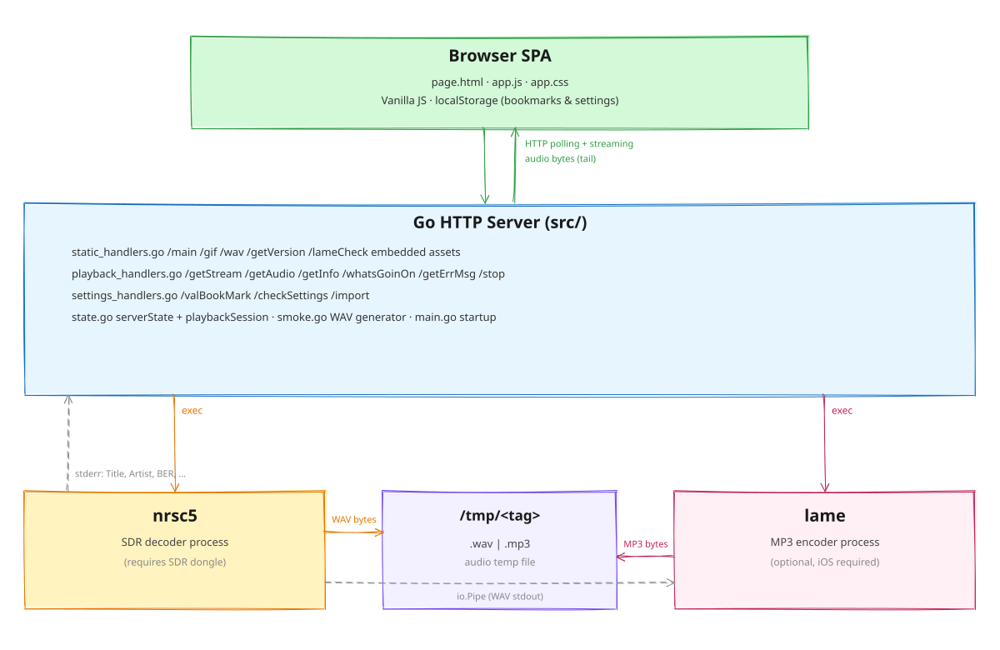

> **Edit this diagram:** [Open in Excalidraw](https://excalidraw.com/#url=https%3A%2F%2Fraw.githubusercontent.com%2Farharvey918%2FyellowShoes%2Fpr-refactor%2Fdocs%2Fcomponent-overview.excalidraw)

---

## Directory Structure

| Path | Purpose |
|------|---------|
| `src/main.go` | Entry point, flag parsing, mux wiring, `nrsc5` binary detection |
| `src/state.go` | `serverState` (global) and `playbackSession` (per-tune) — all concurrency primitives live here |
| `src/playback_handlers.go` | `/getStream`, `/getAudio`, `/getInfo`, `/whatsGoinOn`, `/getErrMsg`, `/stop` |
| `src/settings_handlers.go` | `/valBookMark`, `/checkSettings`, `/import` and all validation helpers |
| `src/static_handlers.go` | HTTP mux, embedded-asset helpers, `/getVersion`, `/lameCheck` |
| `src/smoke.go` | Smoke-mode 440 Hz WAV generator; `fixWAVHeader` for live-stream WAV workaround |
| `src/assets/page.html` | HTML shell — all UI structure |
| `src/assets/app.js` | All client-side logic: state machine, playback, bookmarks, settings |
| `src/assets/app.css` | Styles |
| `src/assets/128.wav` | Catch-up clip sent to late-joining WAV clients |
| `docs/api/openapi.yaml` | Full OpenAPI 3.1 spec for the HTTP API |

---

## Key Concepts

### Session Tags
Every call to `/getStream` generates a random 16-character alphanumeric **tag**.
The tag is the primary session key and is passed to `/getAudio` and `/getInfo`.
`serverState.sessions` indexes the same `*playbackSession` pointer under *both* the
tag and the frequency string, allowing lookup by either.

### Audio File Pattern
`nrsc5` or `lame` writes audio into a temp file at `<tmpDir>/<tag>.wav` or
`<tmpDir>/<tag>.mp3`. `/getAudio` tails this file, sending newly-written bytes to the
browser in a loop. For WAV streams the `fixWAVHeader` function patches the file's
RIFF size fields to `0xFFFFFFFF` (the "streaming WAV" convention) so browsers
will accept a growing file as a valid audio source.

### Catch-Up Clip
When a WAV client first connects to a session that already has more than 8 KB of audio
buffered, the embedded `128.wav` clip is sent first, then playback resumes from
near-live position. This prevents a long initial seek delay.

### Smoke Mode
Setting `YELLOWSHOES_SMOKE=1` disables `nrsc5` dependency and replaces it with an
in-process 440 Hz sine-wave WAV generator. Useful for development, testing, and CI.

### Lace Keys (Settings Portability)
A user on Device A can export their settings (bookmarks + rtlTCP + format + timeout)
to a short server-side JSON file named `<6-char-key>.lace` in `tmpDir`. Another browser
on Device B enters that key into the import form to pull the same settings.

### Idle Reaping
`serverState.monitorIdle()` runs on a 7-second ticker. If `audioConnections == 0` and
the heartbeat is more than 50 seconds old, it calls `killAll()` which marks all sessions
for shutdown and kills all registered `exec.Cmd` processes.

---

## API Surface

| Route | Method | Category | Description |
|-------|--------|----------|-------------|
| `/` | GET | UI | Redirects to `/main` |
| `/main` | GET | UI | Serves `page.html` |
| `/assets/*` | GET | UI | Serves embedded static assets |
| `/gif`, `/basegif` | GET | UI | Wait animation (GIF / base64) |
| `/wav` | GET | UI | Catch-up WAV clip |
| `/getStream` | GET | Playback | Starts decoder, returns session tag |
| `/getAudio` | GET | Playback | Streams live audio for a tag |
| `/getInfo` | GET | Playback | Returns session metadata as JSON |
| `/whatsGoinOn` | GET | Playback | Reports active session or `No_Active_Tags` |
| `/stop` | GET | Playback | Kills all active sessions |
| `/getErrMsg` | GET | Diagnostics | Returns accumulated decoder log lines |
| `/getVersion` | GET | Diagnostics | Returns version string |
| `/lameCheck` | GET | Diagnostics | Returns `OK` or `No lame` |
| `/valBookMark` | POST | Settings | Validates a bookmark |
| `/checkSettings` | POST | Settings | Validates settings; writes Lace file |
| `/import` | POST | Settings | Reads a Lace file and returns settings |

---

## Sequence Diagrams

### 1. Server Startup

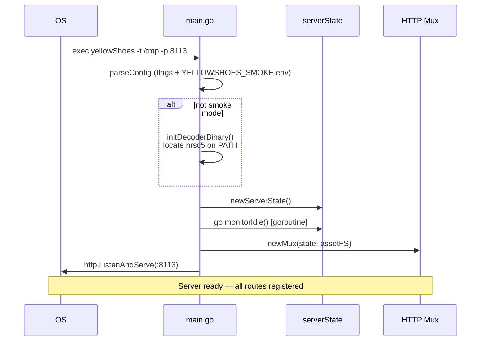
```mermaid
sequenceDiagram
    participant OS
    participant main as main.go
    participant state as serverState
    participant mux as HTTP Mux

    OS->>main: exec yellowShoes -t /tmp -p 8113
    main->>main: parseConfig (flags + YELLOWSHOES_SMOKE env)
    alt not smoke mode
        main->>main: initDecoderBinary()<br/>locate nrsc5 on PATH
    end
    main->>state: newServerState()
    main->>state: go monitorIdle() [goroutine]
    main->>mux: newMux(state, assetFS)
    main->>OS: http.ListenAndServe(:8113)
    Note over OS,mux: Server ready — all routes registered
```

---

### 2. Frontend Boot

```mermaid
sequenceDiagram
    participant Browser
    participant Server

    Browser->>Server: GET /main
    Server-->>Browser: page.html (embedded)
    Browser->>Server: GET /assets/app.js
    Browser->>Server: GET /assets/app.css
    Server-->>Browser: static assets

    Note over Browser: DOMContentLoaded → init()
    par parallel checks
        Browser->>Server: GET /lameCheck
        Server-->>Browser: "OK" or "No lame"
    and
        Browser->>Server: GET /whatsGoinOn
        Server-->>Browser: No_Active_Tags or {tag, freq}
    and
        Browser->>Server: GET /getVersion
        Server-->>Browser: "yellowShoes Ver 3.0.1a"
    end

    Note over Browser: enforceDeviceRules()<br/>iOS → force MP3; block if no lame
    Note over Browser: render() → UI ready
```

---

### 3. Start Playback (WAV)

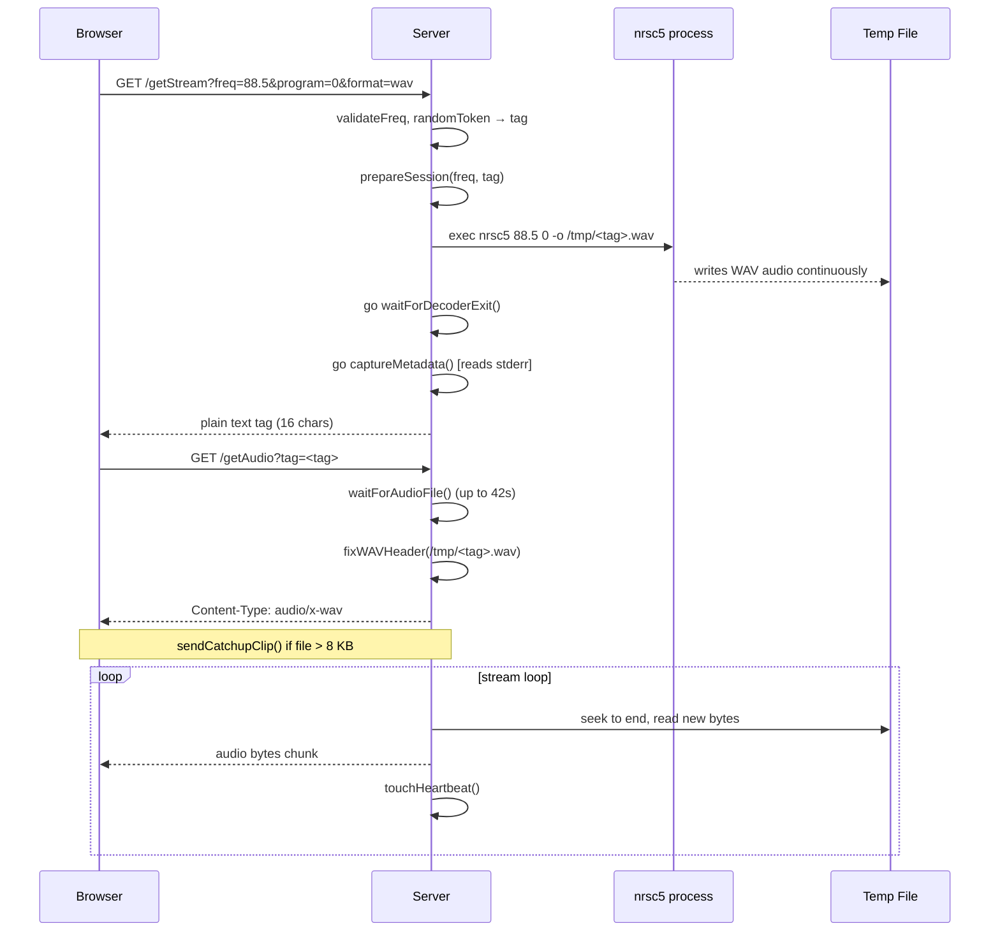
```mermaid
sequenceDiagram
    participant Browser
    participant Server
    participant nrsc5 as nrsc5 process
    participant tmpDir as Temp File

    Browser->>Server: GET /getStream?freq=88.5&program=0&format=wav
    Server->>Server: validateFreq, randomToken → tag
    Server->>Server: prepareSession(freq, tag)
    Server->>nrsc5: exec nrsc5 88.5 0 -o /tmp/<tag>.wav
    nrsc5-->>tmpDir: writes WAV audio continuously
    Server->>Server: go waitForDecoderExit()
    Server->>Server: go captureMetadata() [reads stderr]
    Server-->>Browser: plain text tag (16 chars)

    Browser->>Server: GET /getAudio?tag=<tag>
    Server->>Server: waitForAudioFile() (up to 42s)
    Server->>Server: fixWAVHeader(/tmp/<tag>.wav)
    Server-->>Browser: Content-Type: audio/x-wav
    Note over Server,Browser: sendCatchupClip() if file > 8 KB
    loop stream loop
        Server->>tmpDir: seek to end, read new bytes
        Server-->>Browser: audio bytes chunk
        Server->>Server: touchHeartbeat()
    end
```

---

### 4. Start Playback (MP3 / iOS)

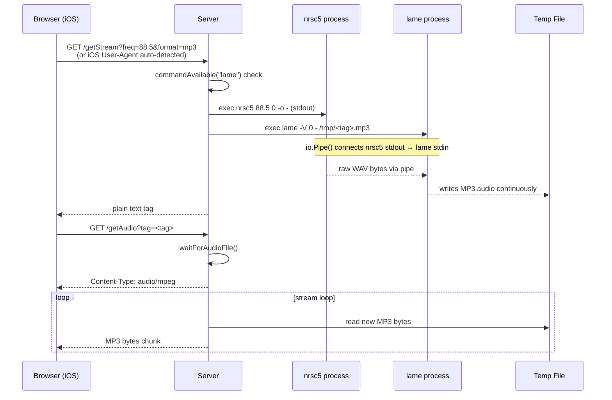
```mermaid
sequenceDiagram
    participant Browser as Browser (iOS)
    participant Server
    participant nrsc5 as nrsc5 process
    participant lame as lame process
    participant tmpDir as Temp File

    Browser->>Server: GET /getStream?freq=88.5&format=mp3<br/>(or iOS User-Agent auto-detected)
    Server->>Server: commandAvailable("lame") check
    Server->>nrsc5: exec nrsc5 88.5 0 -o - (stdout)
    Server->>lame: exec lame -V 0 - /tmp/<tag>.mp3
    Note over nrsc5,lame: io.Pipe() connects nrsc5 stdout → lame stdin
    nrsc5-->>lame: raw WAV bytes via pipe
    lame-->>tmpDir: writes MP3 audio continuously
    Server-->>Browser: plain text tag

    Browser->>Server: GET /getAudio?tag=<tag>
    Server->>Server: waitForAudioFile()
    Server-->>Browser: Content-Type: audio/mpeg
    loop stream loop
        Server->>tmpDir: read new MP3 bytes
        Server-->>Browser: MP3 bytes chunk
    end
```

---

### 5. Smoke Mode Playback

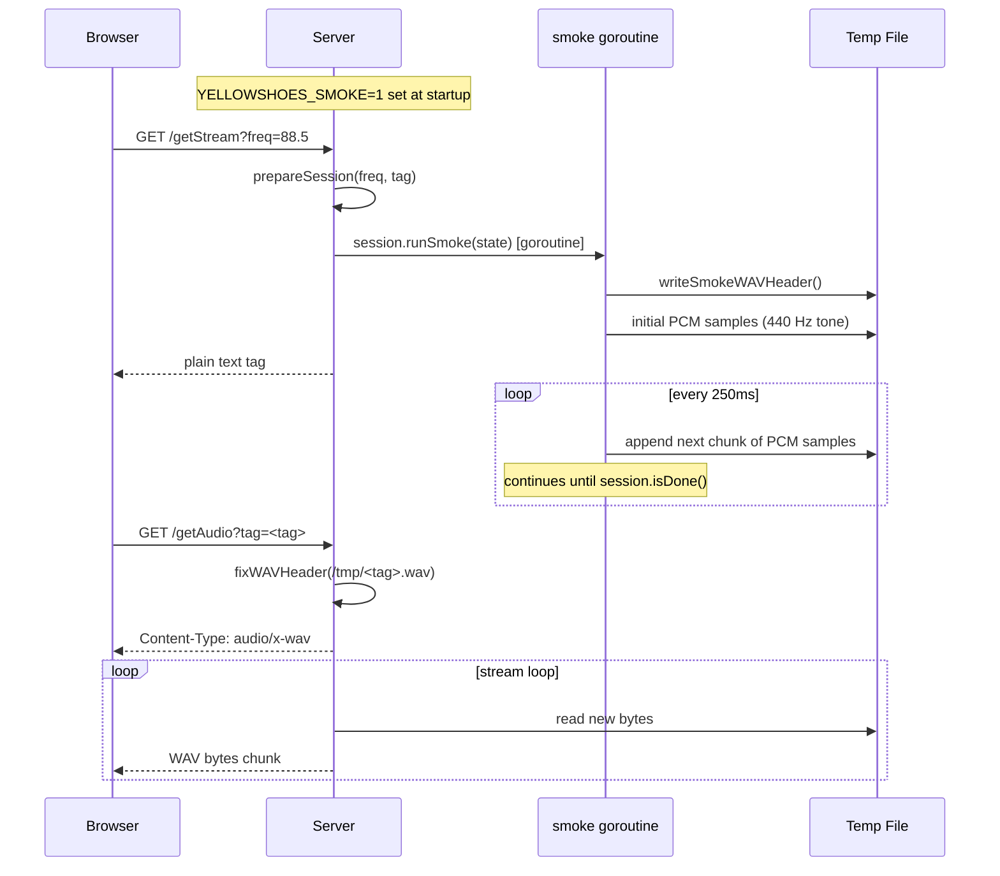
```mermaid
sequenceDiagram
    participant Browser
    participant Server
    participant smoke as smoke goroutine
    participant tmpDir as Temp File

    Note over Server: YELLOWSHOES_SMOKE=1 set at startup

    Browser->>Server: GET /getStream?freq=88.5
    Server->>Server: prepareSession(freq, tag)
    Server->>smoke: session.runSmoke(state) [goroutine]
    smoke->>tmpDir: writeSmokeWAVHeader()
    smoke->>tmpDir: initial PCM samples (440 Hz tone)
    Server-->>Browser: plain text tag

    loop every 250ms
        smoke->>tmpDir: append next chunk of PCM samples
        Note over smoke: continues until session.isDone()
    end

    Browser->>Server: GET /getAudio?tag=<tag>
    Server->>Server: fixWAVHeader(/tmp/<tag>.wav)
    Server-->>Browser: Content-Type: audio/x-wav
    loop stream loop
        Server->>tmpDir: read new bytes
        Server-->>Browser: WAV bytes chunk
    end
```

---

### 6. Live Audio Streaming

This diagram details the internal `streamAudio` loop that backs every `/getAudio`
response, regardless of format.

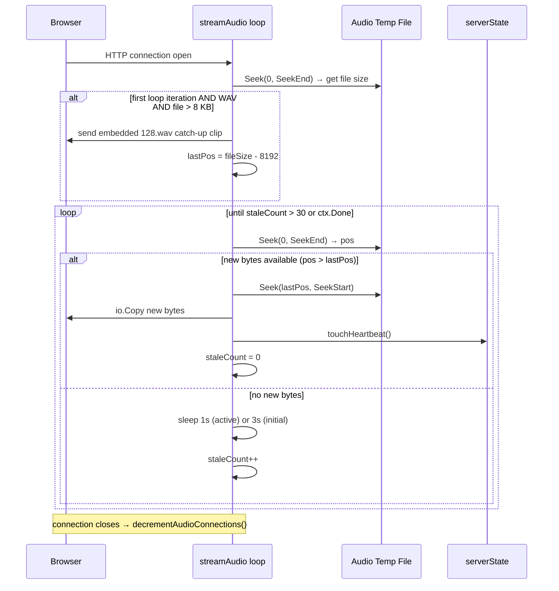
```mermaid
sequenceDiagram
    participant Browser
    participant streamAudio as streamAudio loop
    participant file as Audio Temp File
    participant state as serverState

    Browser->>streamAudio: HTTP connection open
    streamAudio->>file: Seek(0, SeekEnd) → get file size

    alt first loop iteration AND WAV AND file > 8 KB
        streamAudio->>Browser: send embedded 128.wav catch-up clip
        streamAudio->>streamAudio: lastPos = fileSize - 8192
    end

    loop until staleCount > 30 or ctx.Done
        streamAudio->>file: Seek(0, SeekEnd) → pos
        alt new bytes available (pos > lastPos)
            streamAudio->>file: Seek(lastPos, SeekStart)
            streamAudio->>Browser: io.Copy new bytes
            streamAudio->>state: touchHeartbeat()
            streamAudio->>streamAudio: staleCount = 0
        else no new bytes
            streamAudio->>streamAudio: sleep 1s (active) or 3s (initial)
            streamAudio->>streamAudio: staleCount++
        end
    end

    Note over streamAudio,Browser: connection closes → decrementAudioConnections()
```

---

### 7. Metadata Polling

The browser polls `/getInfo` every 3 seconds while playback is active. Separately,
`captureMetadata` on the server reads `nrsc5` stderr line-by-line.

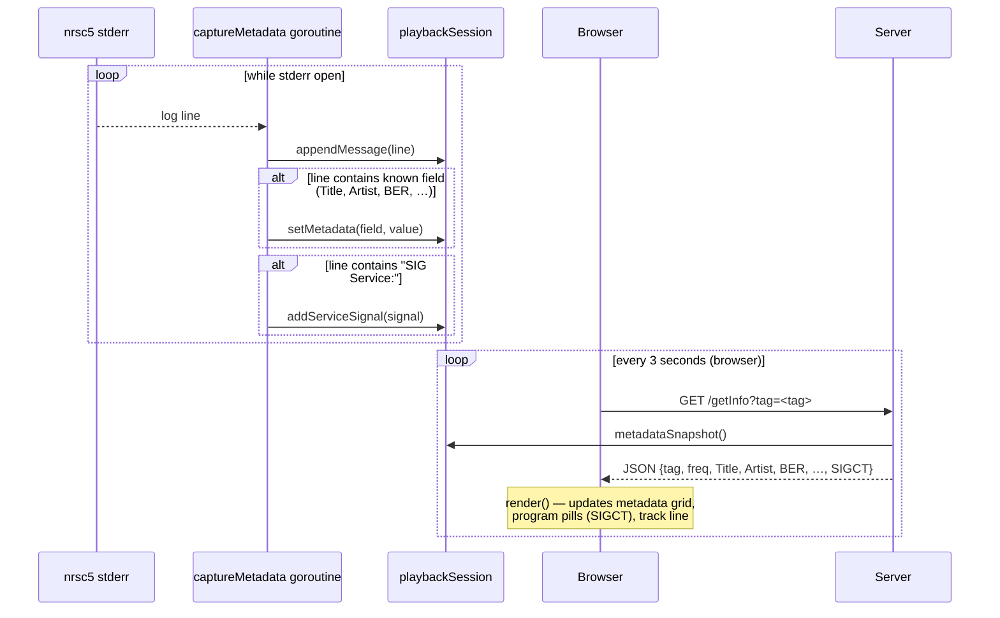
```mermaid
sequenceDiagram
    participant nrsc5 as nrsc5 stderr
    participant captureMetadata as captureMetadata goroutine
    participant session as playbackSession
    participant Browser
    participant Server

    loop while stderr open
        nrsc5-->>captureMetadata: log line
        captureMetadata->>session: appendMessage(line)
        alt line contains known field (Title, Artist, BER, …)
            captureMetadata->>session: setMetadata(field, value)
        end
        alt line contains "SIG Service:"
            captureMetadata->>session: addServiceSignal(signal)
        end
    end

    loop every 3 seconds (browser)
        Browser->>Server: GET /getInfo?tag=<tag>
        Server->>session: metadataSnapshot()
        Server-->>Browser: JSON {tag, freq, Title, Artist, BER, …, SIGCT}
        Note over Browser: render() — updates metadata grid,<br/>program pills (SIGCT), track line
    end
```

---

### 8. Join Active Session

A second browser (or tab) can attach to the already-running decoder stream without
restarting `nrsc5`.

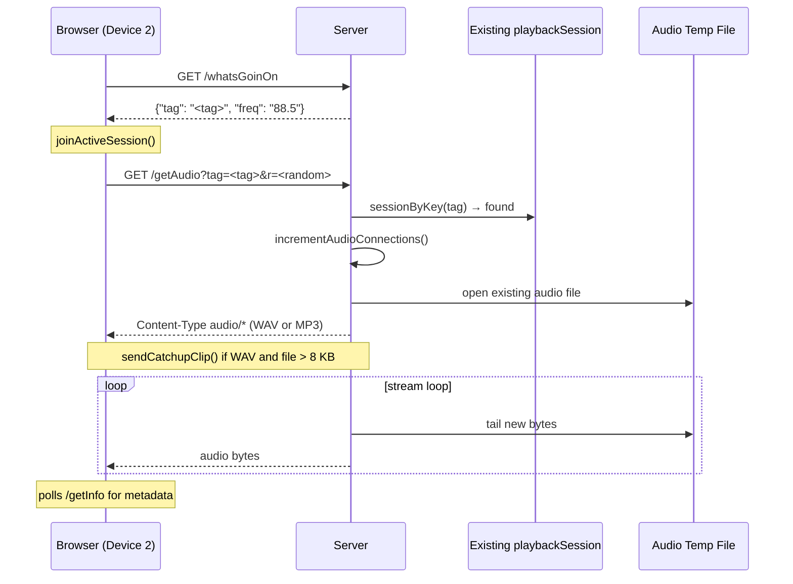
```mermaid
sequenceDiagram
    participant Browser2 as Browser (Device 2)
    participant Server
    participant session as Existing playbackSession
    participant tmpDir as Audio Temp File

    Browser2->>Server: GET /whatsGoinOn
    Server-->>Browser2: {"tag": "<tag>", "freq": "88.5"}

    Note over Browser2: joinActiveSession()
    Browser2->>Server: GET /getAudio?tag=<tag>&r=<random>
    Server->>session: sessionByKey(tag) → found
    Server->>Server: incrementAudioConnections()
    Server->>tmpDir: open existing audio file
    Server-->>Browser2: Content-Type audio/* (WAV or MP3)
    Note over Server,Browser2: sendCatchupClip() if WAV and file > 8 KB
    loop stream loop
        Server->>tmpDir: tail new bytes
        Server-->>Browser2: audio bytes
    end
    Note over Browser2: polls /getInfo for metadata
```

---

### 9. Stop Playback

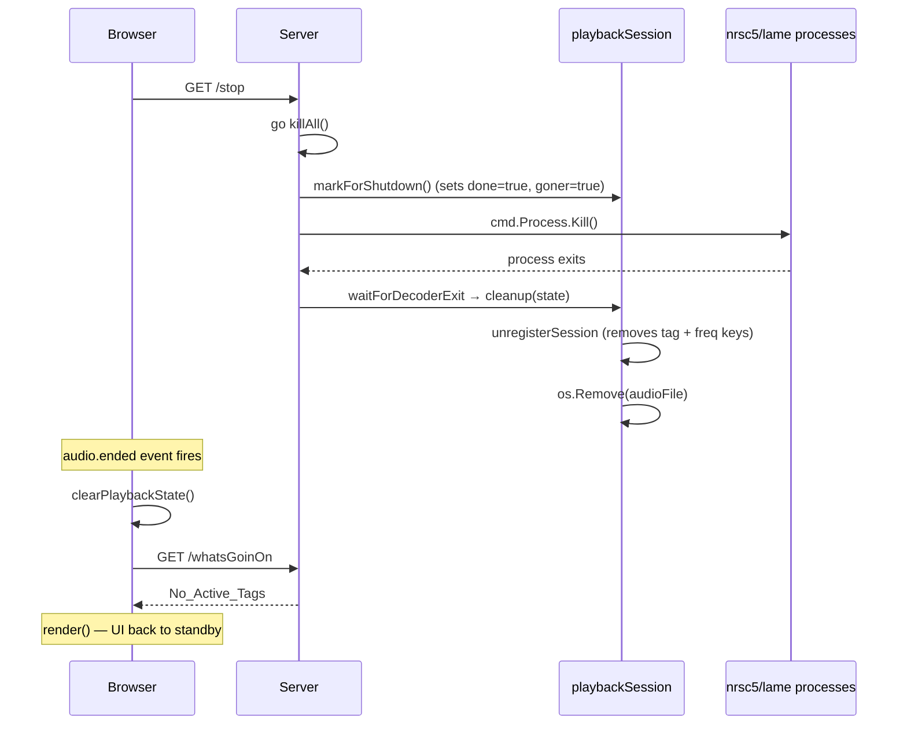
```mermaid
sequenceDiagram
    participant Browser
    participant Server
    participant session as playbackSession
    participant nrsc5 as nrsc5/lame processes

    Browser->>Server: GET /stop
    Server->>Server: go killAll()
    Server->>session: markForShutdown() (sets done=true, goner=true)
    Server->>nrsc5: cmd.Process.Kill()
    nrsc5-->>Server: process exits
    Server->>session: waitForDecoderExit → cleanup(state)
    session->>session: unregisterSession (removes tag + freq keys)
    session->>session: os.Remove(audioFile)

    Note over Browser: audio.ended event fires
    Browser->>Browser: clearPlaybackState()
    Browser->>Server: GET /whatsGoinOn
    Server-->>Browser: No_Active_Tags
    Note over Browser: render() — UI back to standby
```

---

### 10. Idle Session Reaping

If no browser is actively streaming and the heartbeat is stale, the server
self-cleans without a browser request.

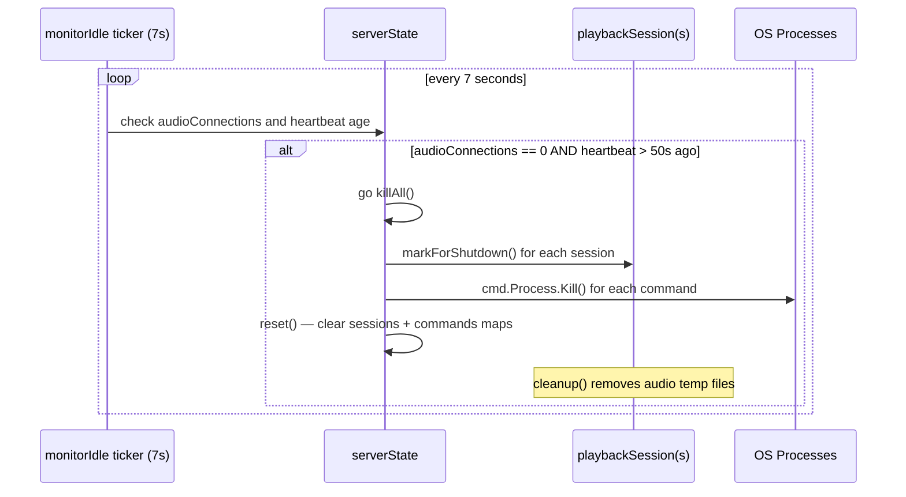
```mermaid
sequenceDiagram
    participant ticker as monitorIdle ticker (7s)
    participant state as serverState
    participant session as playbackSession(s)
    participant procs as OS Processes

    loop every 7 seconds
        ticker->>state: check audioConnections and heartbeat age
        alt audioConnections == 0 AND heartbeat > 50s ago
            state->>state: go killAll()
            state->>session: markForShutdown() for each session
            state->>procs: cmd.Process.Kill() for each command
            state->>state: reset() — clear sessions + commands maps
            Note over session: cleanup() removes audio temp files
        end
    end
```

---

### 11. Settings Export (Lace)

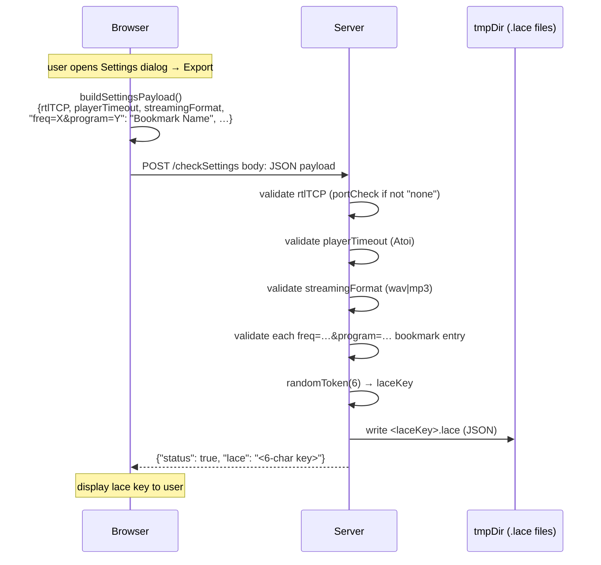
```mermaid
sequenceDiagram
    participant Browser
    participant Server
    participant tmpDir as tmpDir (.lace files)

    Note over Browser: user opens Settings dialog → Export

    Browser->>Browser: buildSettingsPayload()<br/>{rtlTCP, playerTimeout, streamingFormat,<br/>"freq=X&program=Y": "Bookmark Name", …}
    Browser->>Server: POST /checkSettings  body: JSON payload
    Server->>Server: validate rtlTCP (portCheck if not "none")
    Server->>Server: validate playerTimeout (Atoi)
    Server->>Server: validate streamingFormat (wav|mp3)
    Server->>Server: validate each freq=…&program=… bookmark entry
    Server->>Server: randomToken(6) → laceKey
    Server->>tmpDir: write <laceKey>.lace  (JSON)
    Server-->>Browser: {"status": true, "lace": "<6-char key>"}
    Note over Browser: display lace key to user
```

---

### 12. Settings Import (Lace)

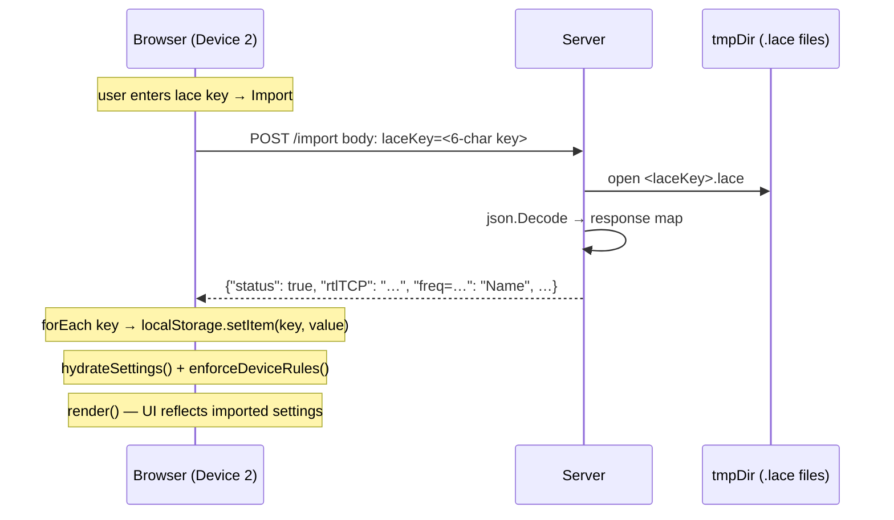
```mermaid
sequenceDiagram
    participant Browser as Browser (Device 2)
    participant Server
    participant tmpDir as tmpDir (.lace files)

    Note over Browser: user enters lace key → Import

    Browser->>Server: POST /import  body: laceKey=<6-char key>
    Server->>tmpDir: open <laceKey>.lace
    Server->>Server: json.Decode → response map
    Server-->>Browser: {"status": true, "rtlTCP": "…", "freq=…": "Name", …}
    Note over Browser: forEach key → localStorage.setItem(key, value)
    Note over Browser: hydrateSettings() + enforceDeviceRules()
    Note over Browser: render() — UI reflects imported settings
```

---

### 13. Add Bookmark

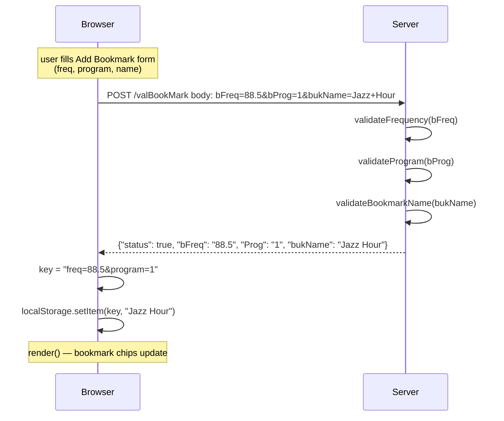
```mermaid
sequenceDiagram
    participant Browser
    participant Server

    Note over Browser: user fills Add Bookmark form<br/>(freq, program, name)

    Browser->>Server: POST /valBookMark  body: bFreq=88.5&bProg=1&bukName=Jazz+Hour
    Server->>Server: validateFrequency(bFreq)
    Server->>Server: validateProgram(bProg)
    Server->>Server: validateBookmarkName(bukName)
    Server-->>Browser: {"status": true, "bFreq": "88.5", "Prog": "1", "bukName": "Jazz Hour"}

    Browser->>Browser: key = "freq=88.5&program=1"
    Browser->>Browser: localStorage.setItem(key, "Jazz Hour")
    Note over Browser: render() — bookmark chips update
```

---

### 14. Play Bookmark

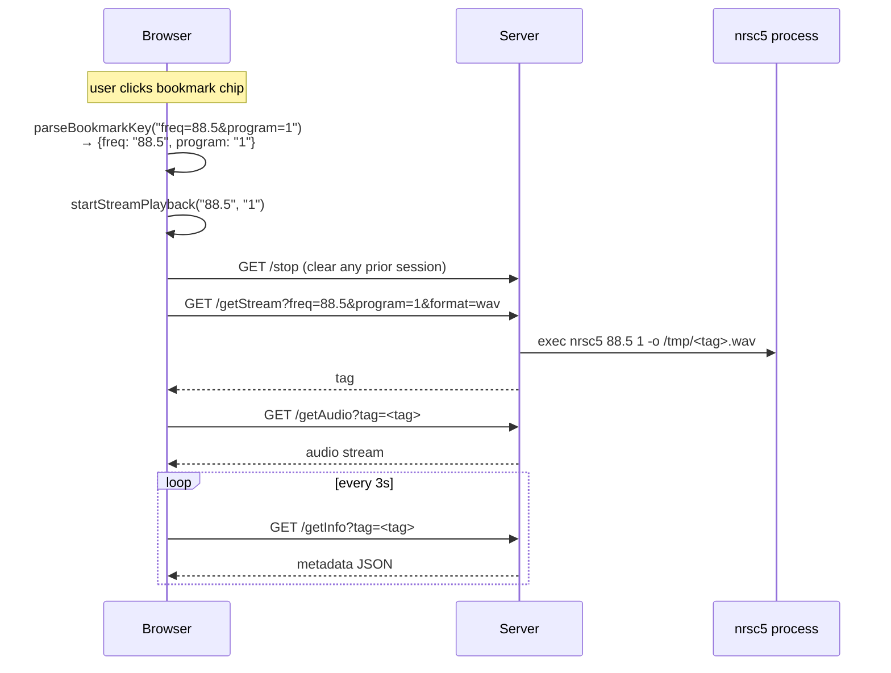
```mermaid
sequenceDiagram
    participant Browser
    participant Server
    participant nrsc5 as nrsc5 process

    Note over Browser: user clicks bookmark chip

    Browser->>Browser: parseBookmarkKey("freq=88.5&program=1")<br/>→ {freq: "88.5", program: "1"}
    Browser->>Browser: startStreamPlayback("88.5", "1")
    Browser->>Server: GET /stop  (clear any prior session)
    Browser->>Server: GET /getStream?freq=88.5&program=1&format=wav
    Server->>nrsc5: exec nrsc5 88.5 1 -o /tmp/<tag>.wav
    Server-->>Browser: tag
    Browser->>Server: GET /getAudio?tag=<tag>
    Server-->>Browser: audio stream
    loop every 3s
        Browser->>Server: GET /getInfo?tag=<tag>
        Server-->>Browser: metadata JSON
    end
```
